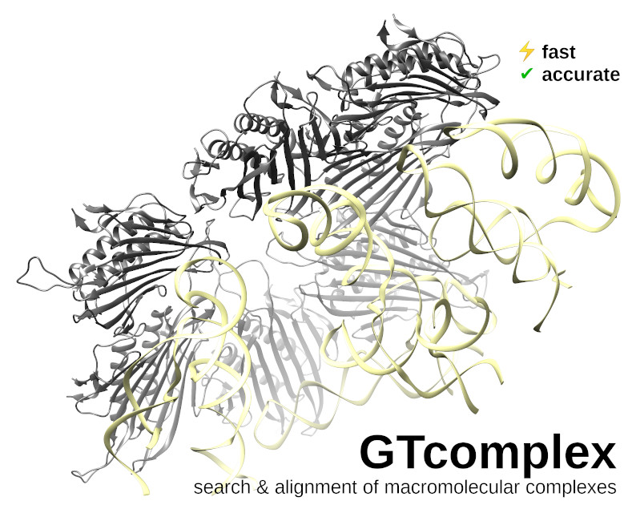

# GTcomplex

**High-performance 3D search and alignment of macromolecular complexes**  
*Fast, accurate, scalable – for proteins, RNAs, DNAs*

## Features

  *  CPU/multiprocessing version (to appear later)
  *  Graphics processing unit (GPU) version
  *  Configurable GPU memory
  *  Utilization of multiple GPUs
  *  Tested on NVIDIA Pascal (GeForce GTX 1080MQ), Volta (V100), Ampere (A100), and Ada Lovelace (GeForce RTX 4090) GPU architectures
  *  Same executable for different architectures
  *  Up to 4 orders of magnitude faster than US-align running on 64 cores
  *  More sensitive and accurate than US-align
  *  Correct TM-scores are guaranteed for produced superpositions
  *  Correct RMSDs are guaranteed for produced alignments
  *  Many options for speed-accuracy tradeoff
  *  Support for PDB, PDBx/mmCIF, and gzip (thanks to [zlib](https://github.com/madler/zlib)) formats
  *  Reading (un)compressed structures from TAR archives 
  *  Allows searching within directories up to three levels deep
  *  **Clustering** ability (GPU only)
  *  Cross-platform/portable code (to be released soon)

## Available Platforms

  GTcomplex was tested on and the binaries are provided for the following platforms:

  *  Linux x64
  *  Windows x64

  Tested compilers include GCC versions 7.5.0, 8.3.0, and 11.4.0; 
  LLVM/Clang version 10.0.0; and native MSVC compilers.

## System requirements (GPU version)

  *  CUDA-enabled GPU(s) with compute capability >=5 (released in 2014)
  *  NVIDIA driver version >=418.87 (>=425.25 for Win64) and CUDA version >=10.1

## System requirements (CPU/multiprocessing version)

  *  GLIBC version >=2.16 (Linux)

## Installation of pre-compiled binaries

  Download or clone the repository:

  `git clone https://github.com/minmarg/gtcomplex.git`

  On Linux, run the shell script and follow the instructions:

  `Linux_installer_GPU/GTcomplex-linux64-installer-GPU.sh`

  On MS Windows, run the GPU-version installer:

  `MS_Windows_installer_GPU/GTcomplex-win64-installer.msi`

## Getting started

  Type `gtcomplex` for a description of the [options](out/gtcomplex_options.md). 

  Query structures and/or directories with queries are specified with the option `--qrs`.
  Reference structures (to align queries with) and/or their directories to be 
  searched are specified with the option `--rfs`.

  Note that GTcomplex reads `.tar` archives of compressed and uncompressed structures.

  Here are some examples:

`gtcomplex -v --qrs=str1.cif.gz --rfs=my_huge_structure_database.tar -o my_output_directory --speed=12 --sort=2`

`gtcomplex -v --qrs=struct1.pdb --rfs=struct2.pdb,struct3.pdb,struct4.pdb -o my_output_directory`

`gtcomplex -v --qrs=struct1.pdb,my_struct_directory --rfs=my_ref_directory -o my_output_directory`

`gtcomplex -v --qrs=str1.pdb.gz,str2.cif.gz --rfs=str3.cif.gz,str4.ent,my_ref_dir -s 0.3 -o mydir`

  Queries and references are processed in chunks.
  The maximum total length of queries in one chunk is controlled with the option 
  `--dev-queries-total-length-per-chunk`. 
  The maximum (minimum) length for a reference **chain** (as opposed to the total complex length) 
  can be specified with the option `--dev-max-length` (`--dev-min-length`).
  Longer (shorter) chains will be skipped during a search.

  The maximum number of query chains is controlled with the `--dev-queries-total-length-per-chunk` 
  option. 
  The default value is 100, but it can be increased to 256. 
  This option calculates the total length across all query chains. 
  There are no constraints on the number of chains in the reference complex, only the 
  available memory may limit the processing of extremely large reference complexes.

## Alignment sorting

  GTcomplex offers the `--sort` option to arrange alignment based on various criteria.
  Users can choose to sort alignments by TM-score, RMSD (root-mean-squared deviation), or the 
  secondary TM-score, 2TM-score, which is calculated over the alignment while excluding 
  unmatched helices.
  Consequently, the 2TM-score penalizes topological inconsistencies more than the TM-score.

  All metrics (TM-scores, RMSDs, etc.) are calculated at both the complex and individual 
  chain levels.

## Clustering

  The GPU version of GTcomplex allows for clustering (by complete or single linkage) of large 
  datasets.
  For example,

`gtcomplex -v --cls=my_huge_structure_database.tar -o my_output_directory`

  instructs GTcomplex to cluster the complexes stored in `my_huge_structure_database.tar` 
  using the default parameters. 
  To obtain the superimposed members of a cluster, run `gtcomplex` with the first member as the 
  query and all other members as references, using the options `--pre-score=0 -s 0 --referenced`. 
  This will produce transformation matrices to superimpose each reference complex onto the query.

## Usage tips and recommendations

### Optimizing performance for large datasets

  * **Leverage fast searching for large data**  
    Use fast searching (`--speed=[10-16]`) when processing very large datasets to 
    significantly reduce runtime.

  * **Enable cached data for faster disk access**  
    Utilize the `-c <cache_directory>` option to cache data and speed up reading from 
    disk when working with numerous query structures.

### Fine-tuning output and memory management

  * **Sort alignments by TM-score normalized by query length**  
    Sort alignments by the query length-normalized TM-score (`--sort=2`) to prioritize 
    structural similarities extending across larger portions of query structures.

  * **Generate transformation matrices for reference structures**  
    Use `--referenced` to generate transformation matrices for reference structures. 
    This allows you to visually inspect all reference structures superimposed on a 
    query in a graphical environment.

  * **Optimize memory usage**  
    Control the memory allocation for GTcomplex using the `--dev-mem` option. 
    This allows for running multiple instances of GTcomplex simultaneously on a single 
    GPU or CPU.

## Reporting issues

Bug reports, comments, suggestions are welcome.

## Contacts

For inquiries, please contact Mindaugas Margelevicius at
[mindaugas.margelevicius@bti.vu.lt](mailto:mindaugas.margelevicius@bti.vu.lt).

## License

Copyright 2025 Mindaugas Margelevicius, Institute of Biotechnology, Vilnius University

[Licensed](LICENSE.md) under the Apache License, Version 2.0 (the "License"); 
you may not use this file except in compliance with the License. 
You may obtain a copy of the License at

[http://www.apache.org/licenses/LICENSE-2.0](http://www.apache.org/licenses/LICENSE-2.0)

Unless required by applicable law or agreed to in writing, software distributed under the 
License is distributed on an "AS IS" BASIS, WITHOUT WARRANTIES OR CONDITIONS OF ANY KIND, 
either express or implied. 
See the License for the specific language governing permissions and limitations under the 
License.

## Funding

This project was supported by an NVIDIA Academic Grant.

